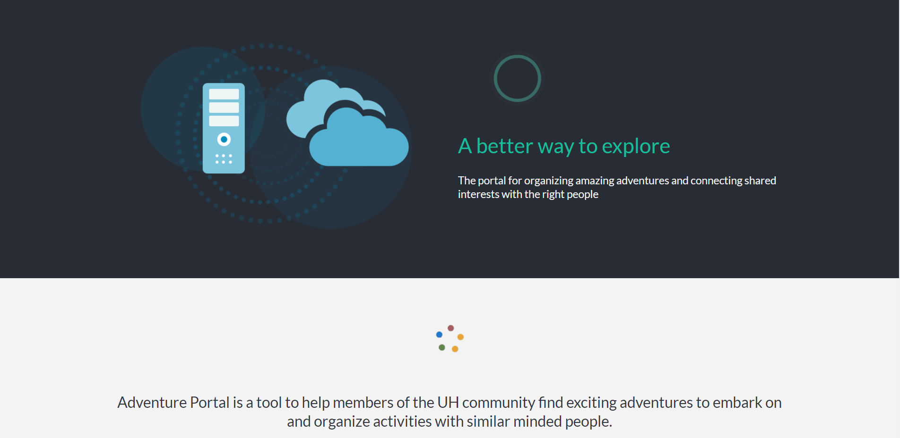
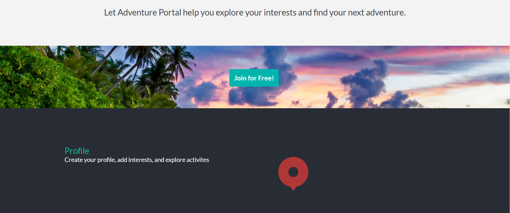
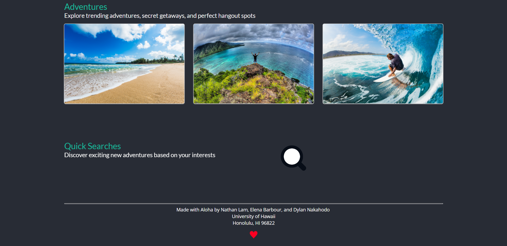
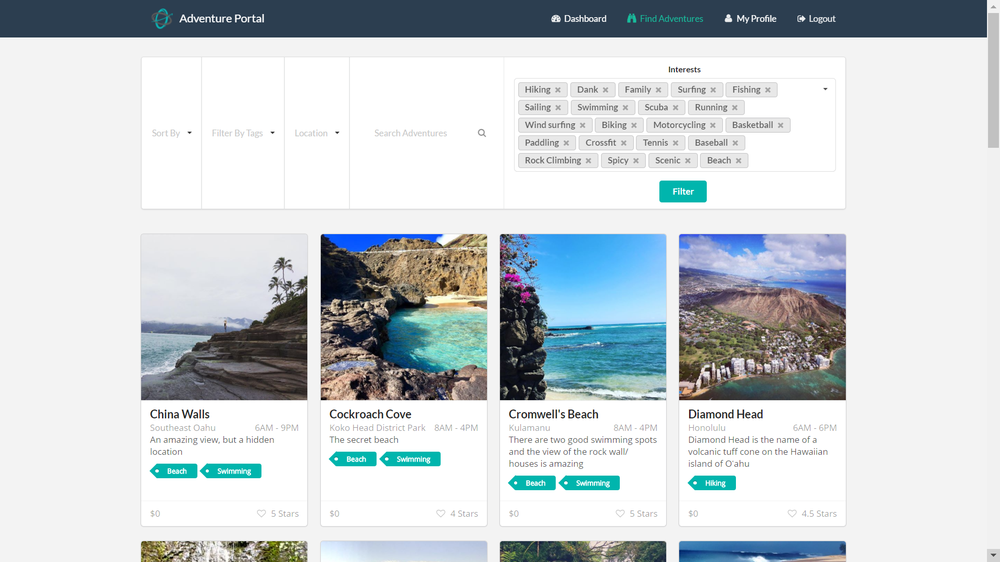
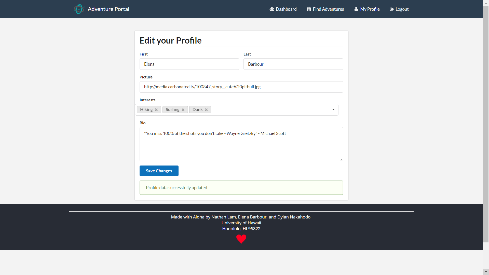
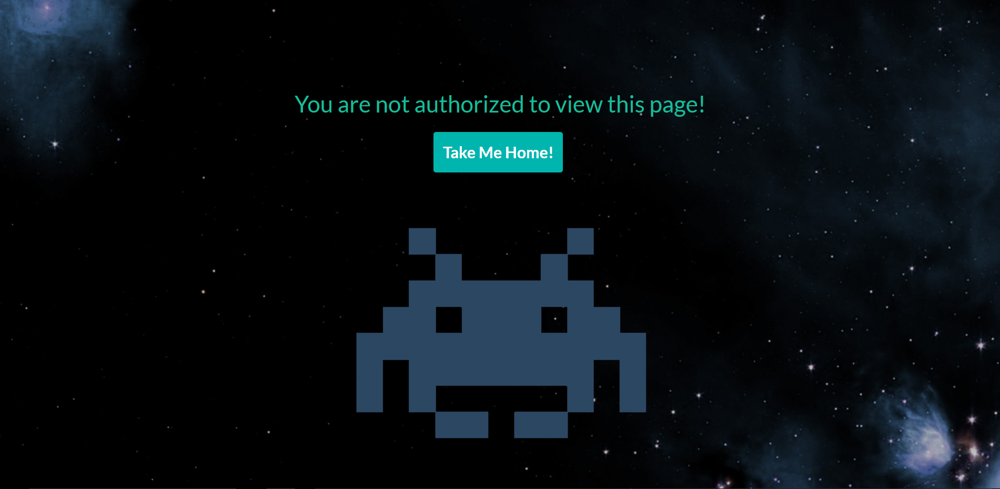
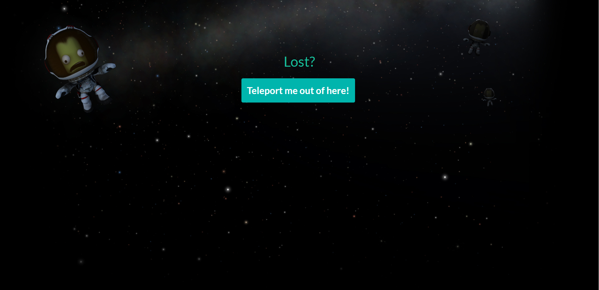

# Adventure Portal
Adventure Portal is a tool to help members of the community find exciting adventures to embark on and organize activities with similar minded people. Have an awesome hangout spot that would be perfect on the weekends? Want to share your best getaway activity? Or do you just want to explore and find something new with other students who just want to do the same?

Let Adventure Portal help you explore your interests and help you embark on your next adventure.

Adventure Portal project page: https://adventure-portal.github.io/


## Landing Page





## Home Page


## Find Adventures Page


## My Profile Page


## Unauthorized Page


## 404 Page


# Developers Guide

* To begin working on Adventure Portal, [Meteor](https://www.meteor.com/) must be installed on your machine. 
* Create a directory to hold the project
* Clone the project to your machine with:
```
git clone https://github.com/adventure-portal/adventure-portal.git
```
* cd into the app/ directory and install libraries with:
```
meteor npm install
```
* Run the application with:
```
meteor npm run start
```
* Test that Adventure Portal is running on localhost:3000 from any browser. If you have an account on the UH test CAS server, you can login. Note: It may take some time to build the project and start up the application after running the commands.

From here, you can use the editor of your choice to begin modifying Adventure Portal's files. Note that Adventure Portal uses the coding style preferences described by this xml [file](http://courses.ics.hawaii.edu/ics314f16/morea/development-environments/ics-se-code-style.xml). To get an idea of the project structure, it is helpful to note that Adventure Portal is based on the meteor-application-template available [here](https://ics-software-engineering.github.io/meteor-application-template/).

For full documentation and project history visit the [project page](https://adventure-portal.github.io/).

# Contributors
  * [Nathan Lam](https://nathancy.github.io/)
  * [Dylan Nakahodo](https://dylannakahodo.github.io/)
  * [Elena Barbour](https://elenambarbour.github.io/)

